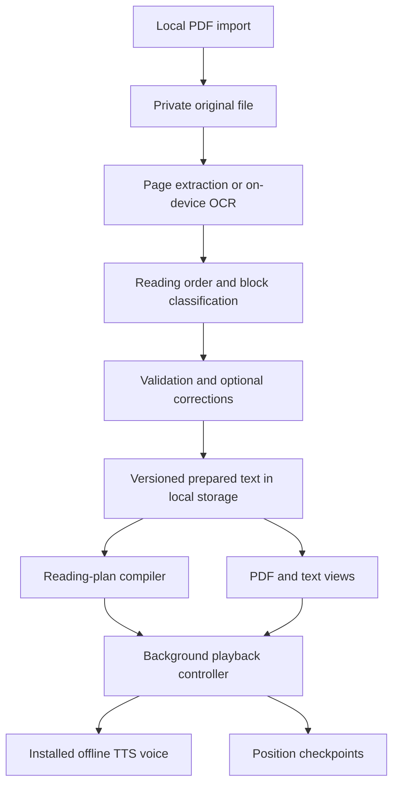

# Offline PDF Reader — product and technical design

Date: 2026-09-10. Status: implementation-ready planning baseline, subject to the explicitly listed feasibility gates.

## 1. Product contract

Build one Flutter application for Android and iOS. Import an English or Turkish PDF, prepare the entire document into persistent reading material, and speak that material later using an installed offline voice. The primary experience is listening with the phone locked.

Preparation produces structured text and reading instructions, not a complete audio recording. No playback is offered until the entire preparation job is complete. Once required resources are installed, importing a local file, preparing it, browsing it, and listening must work without a connection.

### Confirmed requirements

- Baseline physical devices: Samsung Galaxy S24+ and iPhone 13. Support compatible newer devices; do not promise compatibility with untested future OS releases.
- Per-book English or Turkish selection; this controls recognition hints, segmentation, announcements, and speech, not translation.
- Both selectable-text and scanned PDFs, including documents mixing the two.
- Meaningful heading announcements and pauses, paragraphs in reading order, and suppression of repeated running headers/footers.
- Announce tables and skip their contents in narration; preserve them visually.
- Automatically read page footnotes after main text, with a per-book enable/disable switch, enabled by default.
- Prefer printed page numbers for narration and navigation.
- Default listening screen shows controls and metadata without book text. Original PDF and clean reading-text views are optional.
- Save position and support resume, skipping, jumps, search, and bookmarks.
- Complete preparation first, with progress and estimated remaining time. Save results for later use.
- Internet may be used for initial setup and explicit additional downloads. No ongoing connection requirement.

### Proposed implementation defaults

These resolve unspecified details and may be adjusted without changing the product contract: sentence-level resume; previous/next sentence and paragraph controls; foreground-only preparation with checkpoint recovery; English and Turkish UI localization; minimal corrections for extraction mistakes; no account or device sync. Footnote placement at a sentence crossing a page is specified in section 5.

Provisional OS floors: Android 13 and iOS 16, subject to the pinned SDK/plugin compatibility audit in milestone M0. A newer OS floor must still support iPhone 13 and Galaxy S24+ and be recorded before implementation. Hardware age alone is not a reason to drop iPhone 13.

Development uses the iOS Simulator as the primary debugging environment and Android emulators for platform coverage through M4. The user will connect physical phones for final M5 qualification. Hardware-only checks are deferred without blocking implementation; adapter choices remain provisional where simulation cannot establish their behavior. See [the environment policy](IMPLEMENTATION.md#development-environment-policy).

### Outside the first release

Cloud OCR/TTS, translation, summaries, conversational book Q&A, runtime LLMs, complete audiobook export, cross-device sync, handwriting recognition, mathematical equation narration, table interpretation, and guaranteed interpretation of arbitrary scholarly layouts. Endnotes are read where they occur; only page footnotes are relocated into page-footnote groups. No EPUB or camera-scanning workflow yet.

## 2. User experience

| Screen | Content and actions | Important states |
| --- | --- | --- |
| Library | Import; cover/title; language; last position; preparation status; storage; delete | Empty, preparing, paused, needs review, prepared/voice missing, ready |
| Import | System file picker; local-copy progress; title; English/Turkish; footnotes default on | Provider download needed, duplicate, invalid file, password needed, insufficient space |
| Preparation | Stage, completed/total pages, progress bar, estimated time, pause/resume/cancel | Estimating, processing, finalizing, interrupted, recoverable error |
| Book review | Completion report; affected pages; source preview; edit text; classify/reorder blocks; page-label correction | Low quality, unclassified region, explicitly excluded content |
| Listen (default) | Title/cover, printed page, progress, play/pause, sentence and paragraph skips, speed, navigation, view switch | Ready, buffering/starting, speaking, paused, voice missing, completed |
| PDF | Original page, current block highlight, tap a mapped block to start there | Scanned page with OCR overlay, unlinked image region |
| Reading text | Structured headings/paragraphs, current sentence/block, search, bookmarks | Footnotes visibly distinguished, table placeholder |
| Downloads & voices | Installed capabilities, language, voice preview, provider, size when known, setup/download/manage actions | Included, available, downloading, verifying, installed, unavailable, failed |

No transcript is shown on the default Listen screen. Provide accessible labels, large controls, text scaling, and VoiceOver/TalkBack navigation. Cover art is optional; a simple placeholder avoids requiring image generation or network metadata.

### Preparation feedback

- Stages: copying/validating → extracting/OCR → structuring → validating/indexing → complete.
- Show actual pages committed and stage progress; count a page only after its checkpoint is durable.
- During the first few pages show “Estimating time…”; thereafter use observed time for digital versus scanned pages and remaining finalization work. Show an estimate range when variability is high.
- Overall progress remains below 100% until the final artifact and index commit. Never display zero time remaining while substantial work remains.
- Pause at the next safe checkpoint. Cancel retains the imported PDF and committed preparation pages; explicit “Discard preparation” clears partial derived work.
- Explain that preparation requires the app open. Temporarily prevent automatic screen sleep while actively preparing; restore the previous behavior on pause, completion, or exit. Manual locking/backgrounding may suspend the job; resume safely on return.
- A failed/unreadable page cannot silently become an empty successful page. Completion needs successful processing or a recorded user exclusion for each affected page/region.

### Resource management

Resource ownership determines the interface. Show “Included with app” for bundled OCR, “Manage in phone settings” for OS-managed voices, and download/progress/retry/removal controls only for resources actually managed by this app. Open supported settings routes or show precise instructions when no route exists. Recheck availability on return.

Use bundled Latin OCR initially on both platforms; English and Turkish share this script model. This keeps first-release resource handling small. Optional downloadable engines/models are an extension, not a requirement to invent a model hosting service. Native voice installation may not expose byte progress or size; display “Managed by system” rather than fictional metrics. See the official [Android](https://developers.google.com/ml-kit/vision/text-recognition/v2/android) and [iOS](https://developers.google.com/ml-kit/vision/text-recognition/v2/ios) OCR integration guides.

For future app-managed resources: HTTPS; pinned resource manifest/version and integrity digest; temporary download; verify before atomic activation; explicit cancellation/retry; resume only when supported and validated; retain the previous working version on failure. Show storage impact and affected books before removal. Never delete a system voice from our interface. No book content is sent with resource requests.

## 3. Architecture

Use a modular Flutter monolith with pure Dart document and reading logic, narrow native adapters, and local persistence. A backend is not required.

| Component | Responsibility | Does not own |
| --- | --- | --- |
| Import service | Copy/hash/validate local PDF, password lifecycle | OCR, speech |
| PDF adapter | Render, native text geometry, labels/bookmarks when exposed | Semantic classification |
| OCR adapter | Recognize bounded page images into text regions | Final reading order or footnote policy |
| Preparation coordinator | Jobs, checkpoints, cancellation, stage estimates | UI widgets, audio |
| Structure analyzer | Regions, columns, roles, page labels, provenance, warnings | Rewriting content with an LLM |
| Repository | Transactional documents, revisions, progress, settings | Platform media callbacks |
| Reading-plan compiler | Ordered narration events from prepared blocks and preferences | Native voice selection |
| Playback controller | One authoritative playback state, commands, stale callback protection, checkpoints | Re-running OCR |
| Speech/media adapters | Voice discovery, audio focus/session, speech events, lock-screen integration | Book structure |
| Resource registry | Capabilities and truthful install/availability state | Document processing |

Suggested layout: `lib/domain/`, `lib/application/`, `lib/infrastructure/`, and `lib/features/{library,preparation,review,reader,resources}/`. Keep package selection and state-management style modest and consistent once scaffolded. No microservices or general workflow framework.

### Technology choices and gates

| Area | Baseline candidate | Validation required (hardware portions deferred to M5) |
| --- | --- | --- |
| PDF display/render/extraction | `pdfrx` | Confirm usable text geometry, coordinate transforms, scan rendering, and available font/structure metadata |
| OCR | ML Kit Text Recognition v2, bundled Latin model, thin Flutter/native adapter | Corpus quality on both devices, Turkish glyphs, rotated pages, plugin/SDK footprint |
| Speech | Native Android TTS / Apple AVSpeechSynthesizer through `flutter_tts` where sufficient | Offline voice verification, callback behavior, sentence handoff under lock |
| Background controls | `audio_service` and one audio-session owner | Real-device lock-screen, Bluetooth, interruption, and lifecycle tests |
| Local persistence | SQLite, preferably Drift; app-private files for PDFs | Atomic checkpoints, schema migrations, indexed retrieval |
| File import | Maintained system-picker Flutter adapter | Cloud-provider unavailable files, copy durability, permission lifetime |

[`pdfrx`](https://pub.dev/packages/pdfrx) supports Android/iOS PDF viewing and text access, but that is not a promise of heading or table semantics. Validate adapter metadata before relying on it. [`flutter_tts`](https://pub.dev/packages/flutter_tts) provides native voice/progress integration with platform differences. [`audio_service`](https://pub.dev/packages/audio_service) provides the media-control integration and supports TTS-backed handlers; it does not remove the need to validate speech continuation.

Google lists both [English and Turkish as supported Latin-script OCR languages](https://developers.google.com/ml-kit/vision/text-recognition/v2/languages). This establishes a candidate, not adequate recognition accuracy for our books. Package versions and transitive licenses must be pinned and recorded in M0; no claim here that all latest versions are mutually compatible.

## 4. Preparing the document

### Pipeline

1. Copy into private persistent storage, compute content hash, inspect page count and encryption. Obtain a password when needed; keep it in memory unless the user explicitly elects secure local retention. Cloud-backed picker items may require a download before this step completes.
2. For each page, inspect native text coverage and quality. Use native extraction for usable text; OCR pages or regions with missing/garbled text. Merge spatially and avoid duplicates on PDFs already containing an OCR text layer.
3. For OCR, render a bounded image, correct supported rotation, and process serially initially. Start near 200–300 DPI, enforce a pixel-memory cap, and tile oversized pages with overlap/deduplication. Release images immediately. Retry poor regions at an alternate resolution when justified.
4. Persist raw text regions and source coordinates per page. Text geometry is necessary for reading order and source navigation. Do not depend on an OCR confidence field existing on every platform; missing confidence is unknown, not zero or perfect.
5. Run cross-page analysis: repeated margins, likely printed numbering, body-text sizes/spacing, headings, columns, footnotes, tables, and paragraph continuity. Native tags/bookmarks can be evidence if available; validate rather than blindly trust them.
6. Normalize whitespace and line wraps, cautiously repair line-end hyphenation, preserve punctuation/diacritics, and segment English/Turkish sentences. Keep source text plus a normalization map; never silently rewrite grammar or fabricate missing words.
7. Validate content coverage and ordering. Persist warnings for ambiguous layouts, low-quality regions, unsupported notation, and missing labels. Allow local corrections and explicit exclusions. A full document-layout editor is outside scope; text edit, role change, page-local block reorder, and page-label correction are sufficient initially.
8. Build ordered blocks, chapter navigation where confidently available, source anchors, and local search index. Validate references, then atomically activate the prepared revision. Speech preferences do not require OCR to rerun.

### Classification safety

Use multiple signals for destructive-to-narration decisions. A small font alone does not prove a footnote; aligned numbers alone do not prove a table. Preserve every extracted region and assign it to narration, a classified exclusion, or a review issue. An ambiguous body-like region remains readable or blocks review resolution; it is never silently discarded as decoration.

Running headers/footers require repetition across pages plus margin evidence. Retain meaningful chapter openings even if their title also appears in a running header. Tables use cell alignment, repeated row/column structure, borders when available, and region context. Footnotes use position, separation, marker correspondence, text size/spacing, and page context. Borderless tables and multi-column footnotes require corpus validation.

### Printed page labels

Store `pdfPageIndex` separately from a string `printedLabel` (including Roman numerals), its provenance, and confidence. Detect printed numerals from the page image/text; PDF page-label metadata is supporting evidence. Permit page-specific correction and a reviewed range mapping. Handle inserted unnumbered plates, numbering resets, and duplicate labels.

When unknown, say “PDF page 12” / “PDF sayfası 12”; never present an inferred index as a printed number. Jump search lists disambiguating PDF positions when the printed label occurs more than once. Do not announce every page transition by default; use page labels in footnote/table announcements and navigation.

## 5. Reading semantics

The compiler emits typed events such as `speak`, `pause`, `pageBoundary`, and `endOfBook`. Each speech event references source sentence/block IDs and records whether its words are source content or an app announcement. Platform-independent events avoid assuming SSML works identically across engines.

| Content | Default narration |
| --- | --- |
| Heading | “Heading: …” / “Başlık: …”, then a 1,000 ms scheduled pause; avoid redundant prefixes for “Chapter…” / “Bölüm…” headings |
| Paragraph end | 450 ms scheduled pause |
| List item | Preserve item number where meaningful; separate items by 250 ms |
| Table | “Table on page 24, skipped.” / “24. sayfadaki tablo atlandı.”; skip cell contents; read an identified caption once |
| Page footnotes | “Footnotes for page 24.” / “24. sayfanın dipnotları.”, then markers and note text in order |
| Unreadable, explicitly excluded page | “Page 24 was excluded from reading.” / localized equivalent |
| Book end | Completion event, persist completion, stop audio |

These pauses are starting defaults, applied after synthesis completion, not guesses about utterance duration. Natural engine punctuation pauses can add time. Do not add one artificial pause per extracted line. Rate changes affect speech; explicit structure pauses remain fixed initially.

Suppress matched superscript footnote references from inline narration so note numbers are not spoken as part of a sentence. Preserve them visually and read the note marker with the note. Preserve unmatched numbers as source content or flag ambiguity.

Read footnotes after the main content of their source page. If the page ends mid-sentence, finish that sentence on the next page before inserting the pending footnote group; attribute notes to the original printed page. Read any remaining notes at book end. For a note continuing onto the next page, join only when continuity is supported; otherwise flag for review. This sentence-boundary policy prevents a note announcement from splitting a spoken sentence.

Turning footnotes off stops a currently spoken footnote and moves to the next main-text event; otherwise it removes future note groups. Turning them on applies forward from the current position without replaying earlier notes. Persist the preference per book. It changes the reading plan, not stored source text.

Navigation to a main-text sentence starts there without reading earlier page content or earlier footnotes. Previous/next sentence operates on source speech segments in the active plan; paragraph controls skip whole source blocks. Heading/table announcements travel with their corresponding destination block. Clamp at book boundaries and never cross into another book automatically.

## 6. Playback and resume

### Primary implementation

Use one background media handler controlling native offline TTS. Feed bounded utterances at sentence boundaries, splitting exceptional long sentences to respect each engine's maximum input. The UI and lock-screen send commands to this same controller; they do not run their own queues.

Use a session/generation token for every play, seek, voice change, stop, and book switch. Ignore callbacks from obsolete generations. Cancel pending utterances and pauses when changing position. Persist the current source sentence before starting it and advance only on confirmed completion. At a crash boundary, repeating the current sentence is acceptable; silently skipping unread sentences is not.

Native TTS background continuation is a feasibility gate, especially when starting the next utterance after long pauses. Android needs the appropriate [media-playback foreground service configuration](https://developer.android.com/develop/background-work/services/fgs/service-types). iOS needs a playback audio session, background audio capability, and remote-command integration. Plugin installation alone does not establish correctness.

If direct TTS fails the locked-device gate, test a bounded ahead-of-playback audio queue behind the same `SpeechBackend` contract. Apple exposes [speech audio buffers](https://developer.apple.com/documentation/avfaudio/avspeechsynthesizer/write(_:tobuffercallback:)); this is a fallback candidate, not proof that unlimited background synthesis works. Record queue size, cache eviction, voice/rate invalidation, and background replenishment tests in an ADR. Do not silently change the product to whole-book audio generation. If neither approach passes, stop that milestone with evidence and a concrete product decision.

### Required behavior

- Lock-screen/headset: play/pause and previous/next sentence where OS controls permit. In-app paragraph jumps, printed-page/chapter jump, search, and bookmarks.
- Save on sentence boundaries, pause, seek, interruption, and lifecycle events. Resume at the beginning of the saved sentence; do not promise exact word/time resume across devices or engine versions.
- Phone call/audio-focus loss: pause and checkpoint. Resume only on explicit play in the first release, avoiding unexpected speech after a call.
- Headphone disconnection: pause. Route changes must not cause simultaneous speaker/headphone output under app control.
- Force-stop, app termination, or reboot: playback may stop; opening the app restores position without autoplay. Normal screen locking must not stop active playback.
- Missing/removed voice: retain the prepared book, block playback with a resource recovery action, and never silently select an online or wrong-language voice.
- No full-duration seek bar promising exact seconds without generated audio. Show content progress and sentence/page navigation; any remaining listening duration is labeled estimated.
- Keep metadata and controls coherent after pause, completion, and book switches. Offer generic lock-screen metadata for users who wish to hide the book title.

Offline availability is capability-based. Android supports filtering voices by [network requirement](https://developer.android.com/reference/android/speech/tts/TextToSpeech.Engine). iOS needs installed voice enumeration and a real offline synthesis check; do not assume an Android-style flag exists. Preview selected voices and verify cold playback in airplane mode during device qualification.

## 7. Local data contracts

Use immutable prepared revisions plus transactional mutable job/progress records. IDs below are logical contracts, not mandatory SQL spellings.

| Record | Required fields |
| --- | --- |
| Book | ID, original hash/path, title, language, imported timestamp, active revision ID |
| PreparationJob | ID, book ID, pipeline/model versions, status, committed stages/pages, timings, issues, attempt/cancellation state |
| Page | PDF index, dimensions/rotation, printed label/provenance, extraction method, completion/exclusion state |
| SourceRegion | ID, page index, normalized coordinates, raw text, extraction provenance, quality evidence |
| ReadingBlock | ID, revision ID, role, ordered source-region references, normalized text, heading level, footnote association, normalization map |
| Sentence | ID, block ID, text offsets and source anchors, language |
| ReviewIssue/Correction | Source references, reason/severity, proposed/current value, user resolution, revision lineage |
| BookPreferences | Voice provider/ID, language, rate, footnotes enabled, heading announcements enabled |
| ReadingPosition | Book/revision ID, source sentence ID, event kind, pending footnote state, last completed event ID, completed flag, timestamp |
| Bookmark | Book/revision, source anchor, user label, timestamp |
| Resource | Provider/ID/version/language, ownership, availability, verified path/hash when app-managed |

Source coordinates use a documented normalized top-left coordinate space, with explicit transforms for PDF rotation/crop and rendered OCR images. Use those transforms for highlights; never treat OCR pixels as raw PDF points.

Regenerate plan IDs from stable source IDs plus policy version; persist enough footnote/event state to avoid confusing a note with main text on resume. Source anchors survive preference changes. Reprocessing creates a new revision, remaps bookmarks/progress by provenance when unambiguous, and asks the user to choose a location if mapping is uncertain. Never reuse the same numeric offset against unrelated new text.

Commit pages atomically; recover interrupted jobs from the last committed checkpoint. Activate a prepared revision only after all references and page dispositions validate. Keep the previous working revision until replacement succeeds. Changing voice, speed, or footnotes does not invalidate OCR. Language changes may require resegmentation/reanalysis; rerun OCR only if recognition configuration actually changes.

“Prepared” is artifact status; “Ready to listen” is derived from artifact completion, resolved blocking issues, and currently available compatible voice. Losing a voice must not reset preparation.

## 8. Privacy, storage, and operations

- Keep PDFs, derived text, corrections, and positions in app-private persistent storage. No account, advertising SDK, cloud document transfer, or content-bearing telemetry.
- Exclude book content/derived files from automatic cloud backup by default using platform backup controls; explain that deleting the app may remove the library. Platform protection does not make a compromised device safe.
- Keep content and passwords out of logs and crash reports. Diagnostic records use stage/error codes, durations, and counts. User-facing titles and optional lock-screen metadata are separate from diagnostic logging.
- Require only file-picker access and necessary media integration. No microphone, contacts, location, or broad shared-storage access is needed for TTS.
- Native speech providers and SDKs are dependencies to audit. Prefer verified offline voices; do not claim control over every system service's unrelated network activity.
- Parse PDFs as untrusted input: bounded rendering dimensions, resource limits, cancellation, updated dependencies, and actionable failures. Book text is never executable instructions.
- Check space before import and throughout preparation. Temporary OCR images are disposable; original and prepared files are not OS-evictable cache. Clear temp files after successful checkpoints and on recovery.
- Confirm book deletion with its storage impact; delete that book's original, revisions, index entries, bookmarks, and position while retaining shared resources. No bulk deletion implicit in resource cleanup.
- No per-minute API costs. Native dependencies affect binary size; optional model delivery would add hosting/bandwidth and license obligations. Real-device testing and device/distribution signing are deferred to final hardware/release qualification; they are not prerequisites for simulator development.

## 9. AI pattern and tradeoffs

The runtime pattern is a staged document-processing pipeline: extract → classify → validate → compile narration. OCR is on-device ML; orchestration and narration policy are deterministic for a fixed prepared revision. It is not a collection of autonomous agents.

An LLM is not necessary for the first release. Adding one increases model size, memory, battery use, validation work, and the risk of omissions or invented text. If corpus evidence later justifies an optional local layout model, isolate it behind `StructureAnalyzer`: constrained region labels/order references only, no free-form replacement prose, complete source coverage validation, versioned outputs, and fallback to review. A downloaded model must not be needed to open books already prepared without it.

For development, use bounded specialist coding agents under one integrator after interface contracts are agreed. That workflow is defined in [IMPLEMENTATION.md](IMPLEMENTATION.md); it does not become app architecture.

## 10. Risks and release decisions

| Risk | Mitigation and release consequence |
| --- | --- |
| OCR/structure quality varies by scan | Frozen bilingual corpus, preserved source, review/corrections; do not silently lower quality targets |
| Locked-screen speech stops at utterance boundaries | M0 simulator/emulator investigation; M5 physical-device soaks; backend remains replaceable until hardware qualification |
| Turkish voice quality differs by device | On-device voice preview and native-speaker listening rubric; downloadable alternatives only if needed |
| Preparation consumes memory/heat/battery | Bounded page processing, persisted checkpoints, thermal pause, measured performance |
| Printed labels or footnotes misclassified | Provenance, uncertainty state, targeted correction, source-coverage invariant |
| System resource APIs differ | Ownership-aware UI, truthful availability, settings guidance rather than fake download controls |
| Future SDK or OS changes | Pin tested dependencies, record device/OS matrix, rerun lifecycle smoke tests on upgrades |

The numeric gates and failure scenarios in [ACCEPTANCE_AND_TESTS.md](ACCEPTANCE_AND_TESTS.md) govern release. M0 records simulator/emulator evidence and deferred hardware checks; M5 establishes phone feasibility and performance. No validation result is claimed by this design document.
